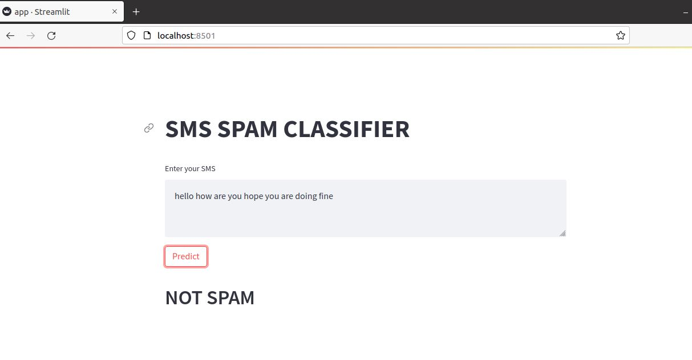

# End to end SMS-Spam-Classifier

📧 Spam Classifier

A machine learning web app that detects spam messages using Natural Language Processing (NLP) techniques and a Naive Bayes model.
This project demonstrates end-to-end text classification—data cleaning, exploratory analysis, model building, and deployment.
🚀 Features

Interactive Web App built with Streamlit for real-time message classification

Text preprocessing with NLTK (tokenization, stopword removal, vectorization)

Model training and evaluation using scikit-learn (Gaussian, Multinomial, Bernoulli Naive Bayes)

Pickle files (model.pkl, vectorizer.pkl) for easy re-use and deployment

Data visualization with Seaborn and Matplotlib (heatmaps, pairplots, histograms)

🗂️ Dataset

Source: spam.csv (public SMS spam collection)

## Webapp Link : https://smsfilter.herokuapp.com/

📊 Results

The Multinomial Naive Bayes model delivered high accuracy and precision, effectively distinguishing spam from legitimate messages.
